**[Colab](https://colab.research.google.com)** is a free notebook environment that runs entirely in the cloud. You and team members can edit documents the way you work with [Google docs](https://docs.google.com). It supports many popular Machine Learning(**ML**) libraries such as Keras,Tensorflow,Pytorch etc.

## Why Colab?
 It allows one to write and execute Python in a browser with:
 * Zero configuration required
 * Free access to GPUs
 * Easy sharing

One can leverage **free Graphics Processing Units**(GPUs) for machine, scientific computing and 3D visualizations. Scientists, Artists and Engineers need access to massively parallel computational power. Deep learning, physical simulation or molecular modelling are accelerated with several **GPU** types such as NVIDIA Tesla K80, P100, P4, T4 and V100 available depending on compute or visualization needs.

# Table of Contents

- [Basic Python Operations in Notebooks](#basic-python-operations-in-notebooks)
    - [Print My First Notebook](#my-first-notebook)
        - [Uploading data to your Colab environment from your local machine](#Uploading-data-to-your-Colab-environment-from-your-local-machine)
        - [Downloading Datasets into Google Drive via Google Colab](#Downloading-Datasets-into-Google-Drive-via-Google-Colab)
        - [Saving your notebook to Google drive](#Saving-your-notebook-to-Google-drive)
        - [Saving your notebook to Github](#Saving-your-notebook-to-Github)
        - [Enabling GPU](#Enabling-GPU)
    - [Variables & Arithmetic](#Variables-and-Arithmetic)
    - [Functions](#Functions)
- [Machine Learning Intro](#Machine-Learning-Intro)
    - [Model Fitting]()
    - [Prediction]()
    - [Cross-Validation]()
- [How to run a job with GPU]()

---
## Basic Python Operations in Notebooks
### My First Notebook


You will need a Gmail account as Colab implicitly uses Google Drive for storing your notebooks, ensure that you are logged in to your Google Drive account before proceeding further.

Step 1 – Open this URL in your browser.[https://colab.research.google.com](https://colab.research.google.com) It will display the following Screen.


Step 2 – Click on the New Notebook link at the bottom of the screen. A new notebook appears.


If you are familiar with Jupyter notebooks, the interface looks more or less the same. You have an input cell and an output cell. Above we have the input Cell.

By default, the name of your notebook is labelled Untitled0 for the first notebook , this can be changed for easier tracking of your projects.

Step – 3 To rename your notebook, click on the file tab , then click rename . 


Change your name to MyFirstNotebook as shown below.


Step – 4 Connect to a runtime server by clicking the connect button as shown below


It will connect to a specified runtime and show the screen below.


Step 5- You can now type your code in the cell shown .Type

```python
print(“Welcome to your first notebook”)
```


Step 6- To run the cell, you can either use Shift+Enter keys or click Runtime>Run the Focused Cell


Step 7- Click on +Code tab above to create a code cell. 

Congratulations🎉, you just created a google Colab notebook. Navigate  to the extreme left pane and click on the three lines . Below is the screen that will show.Here you can navigate your notebook easily to various parts of it such as sections.


Also click on <> button  to view code snippets that can easily be searched and used directly in your colab notebook.


#### Uploading data to your Colab environment from your local machine.
By default , there is  a sample data folder created in your environment variable that you can expand and when you click on an individual file, a third side pane appears on the extreme right . This can also be used as a text editor to manipulate the text in that file .

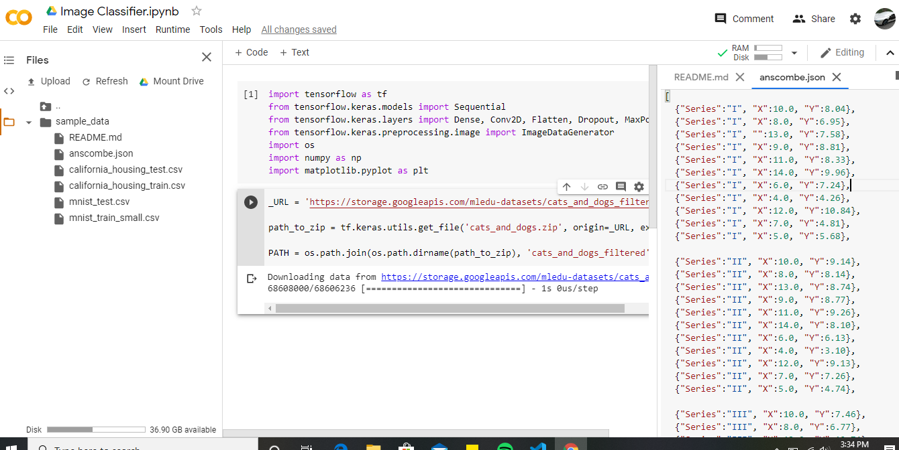

Click on the Folder icon at the left pane , then the Upload button. Below is the window that pops up.


Select the files you wish to upload and click Open.

#### Downloading Datasets into Google Drive via Google Colab

First, we will have to mount our google drive to our notebook environment. This is by clicking the folder icon at the extreme left pane and then the mount Drive button at the top .You will have to authorize the right gmail account ,so the screen below is shown.


Click on connect to google Drive button and the drive folder is created in your working directory structure so you can either move data to your Google drive or export it from there into your runtime environment.


#### Saving your notebook to Google drive

In order to do this, you will have to click on File>Save a Copy in Drive and follow the prompts.

#### Saving your notebook to Github

First, you will have to click on File>Save a Copy in Github.Incase it is the first time , you are prompted with an authorization window  shown below.


Edit the public repository you wish to save your notebook in or automatically Colab creates a public repo named your file title. You can also change the commit message as shown below.


---

### Getting started with running a GPU job on Google Colab.

### Enabling GPU

To successfully run a GPU job, you need to change your runtime type by clicking Runtime>Change runtime type. The window below shows.


Select the drop down at the Hardware accelerator then choose GPU.


Click the save button and you should be able to read the words Connected to a Python 3 GPU after hoovering over the RAM Disk button above as shown below


By default, Colab gives you about 12GB of ram and 68 GB of storage. The RAM can be upgraded to 25GB or more if you run a program that utilizes all of it up.

You can run your code in the cells as shown above to kick start your project.

**NB:** Incase you are doing a  computational intensive program, it is advisable to always first change your runtime to GPU before you start typing your code. Also you can always double ckeck to see if you are connected to a GPU by running the command.

```python
import tensorflow as tf
tf.test.gpu_device_name()
```

If the GPU is enabled, it will give the following output below


```python
/device:GPU:0
```

### Variables and Arithmetic

Within a new input cell, type a variable named seconds and give it a value of 3600 as shown below

```python
seconds = 3600
```
You run the above cell and calculate the minutes in the above seconds using the function below
```python
minutes = seconds // 60
print("There are " + str(minutes) + " minutes are in " + str(seconds) + " seconds")
```
The output cell should show 

```python
There are 60 minutes are in 3600 seconds
```

### Functions

* We will run the code below for a recursion function by typing it into the input cell and pressing the Shift+Enter keys


Recursion is a common mathematical and programming concept. It means that a function calls itself. This has the benefit of meaning that you can loop through data to reach a result.


You should be very careful with recursion as it can be quite easy to slip into writing a function which never terminates, or one that uses excess amounts of memory or processor power. However, when written correctly recursion can be a very efficient and mathematically-elegant approach to programming.

In this example, `tri_recursion()` is a function that we have defined to call itself ("recurse"). We use the k variable as the data, which decrements `(-1)` every time we recurse. The recursion ends when the condition is not greater than 0 .

```python
def tri_recursion(k):
  if(k > 0):
    result = k + tri_recursion(k - 1)
    print(result)
  else:
    result = 0
  return result

print("\n\nRecursion Example Results")
tri_recursion(6)
```
The output cell should be as below


```python

Recursion Example Results
1
3
6
10
15
21
21
```

The reason why 1 is printed before the 21 is because of the stack that is formed and that puts it ontop of the rest of the numbers followed by 3 then 6 then 10 ....

# Machine Learning Intro
* By now you have all the notebook basics at your finger tips. Lets dive into some machine learning using scikit-learn. I assume you have a basic working knowledge of ML practices.

#### Scikit-Learn
Scikit-learn is an open source machine learning library that supports supervised and unsupervised learning. It also provides various tools for model fitting, data preprocessing, model selection and evaluation, and many other utilities.

* By default, this library is pre installed in google colab so no need to run the pip installation command.

* Scikit-Learn provides dozens of built-in machine learning algorithms and models, called estimators. Each estimator can be fitted to some data using its fit method.

### Model Fitting
This is an example to fit a RandomForestClassifier with some very basic data. You should try it out in a new colab notebook.
Type the code below in an input cell then run it.

```python
from sklearn.ensemble import RandomForestClassifier
clf = RandomForestClassifier(random_state=0)
X = [[ 1,  2,  3],[11, 12, 13]]  # 2 samples, 3 features
y = [0, 1]  # classes of each sample
clf.fit(X, y)

```

The output cell should be:

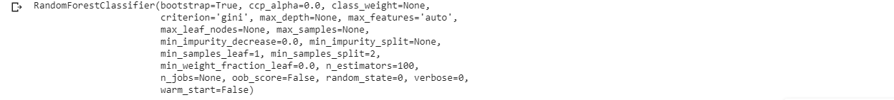

The fit method generally accepts 2 inputs:

* The samples matrix (or design matrix) `X`. The size of `X` is typically `(n_samples, n_features)`, which means that samples are represented as rows and features are represented as columns.
* The target values `y` which are real numbers for regression tasks, or integers for classification (or any other discrete set of values). For unsupervized learning tasks, `y` does not need to be specified. `y` is usually 1d array where the `i` th entry corresponds to the target of the `i` th sample (row) of `X`.

Both `X` and `y` are usually expected to be numpy arrays or equivalent array-like data types, though some estimators work with other formats such as sparse matrices.


### Prediction
Once the estimator is fitted, it can be used for predicting target values of new data. You don’t need to re-train the estimator:

```python
clf.predict(X)  # predict classes of the training data
clf.predict([[4, 5, 6], [14, 15, 16]])  # predict classes of new data
```

# How to run a job with GPU

We will now do an example of image classification while running it on a GPU. 

This example shows how to classify cats or dogs from images.
We shall build an image classifier using `tf.keras.sequential` model and load the data using `tf.keras.preprocessing.image.ImageDataGenerator`.
The following concepts will be emphasized :

* _Building data_ into pipelines to efficiently work with data on disk to use with the model.
* _Overfitting_ - How to identify and prevent it.
* _Data augmentation_ and _dropout_ - Key techniques to fight overfitting in computer vision tasks to incorporate into the data pipeline and image classifier model.

### Import Packages
Let's start by **[changing to a GPU runtime](#Enabling-GPU)** then importing the required packages into our colab notebook. The `os` package is used to read files and directory structure, `NumPy` is used to convert python list to numpy array and to perform required matrix operations and `matplotlib.pyplot` to plot the graph and display images in the training and validation data.
Type the code below in an input cell and run it to import packages

```python
import tensorflow as tf
```

```python
from tensorflow.keras.models import Sequential
from tensorflow.keras.layers import Dense, Conv2D, Flatten, Dropout, MaxPooling2D
from tensorflow.keras.preprocessing.image import ImageDataGenerator

import os
import numpy as np
import matplotlib.pyplot as plt
```
### Load Data
Begin by downloading the dataset. This tutorial uses a filtered version of Dogs vs Cats dataset from Kaggle. Download the archive version of the dataset and store it in the "/tmp/" directory.

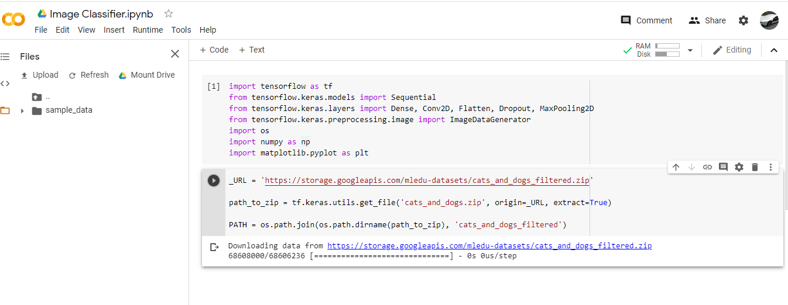

The dataset has the following directory structure:

<pre>
<b>cats_and_dogs_filtered</b>
|__ <b>train</b>
    |______ <b>cats</b>: [cat.0.jpg, cat.1.jpg, cat.2.jpg ....]
    |______ <b>dogs</b>: [dog.0.jpg, dog.1.jpg, dog.2.jpg ...]
|__ <b>validation</b>
    |______ <b>cats</b>: [cat.2000.jpg, cat.2001.jpg, cat.2002.jpg ....]
    |______ <b>dogs</b>: [dog.2000.jpg, dog.2001.jpg, dog.2002.jpg ...]
</pre>

After extracting its contents, assign variables with the proper file path for the training and validation set.

```python
train_dir = os.path.join(PATH, 'train')
validation_dir = os.path.join(PATH, 'validation')
```

```python
train_cats_dir = os.path.join(train_dir, 'cats')  # directory with our training cat pictures
train_dogs_dir = os.path.join(train_dir, 'dogs')  # directory with our training dog pictures
validation_cats_dir = os.path.join(validation_dir, 'cats')  # directory with our validation cat pictures
validation_dogs_dir = os.path.join(validation_dir, 'dogs')  # directory with our validation dog pictures
```

### Understanding the data 
Let's look at how many cats and dogs images are in the training and validation directory:

```python
num_cats_tr = len(os.listdir(train_cats_dir))
num_dogs_tr = len(os.listdir(train_dogs_dir))

num_cats_val = len(os.listdir(validation_cats_dir))
num_dogs_val = len(os.listdir(validation_dogs_dir))

total_train = num_cats_tr + num_dogs_tr
total_val = num_cats_val + num_dogs_val
```

```python
print('total training cat images:', num_cats_tr)
print('total training dog images:', num_dogs_tr)

print('total validation cat images:', num_cats_val)
print('total validation dog images:', num_dogs_val)
print("--")
print("Total training images:", total_train)
print("Total validation images:", total_val)
```
The output cell should be as below

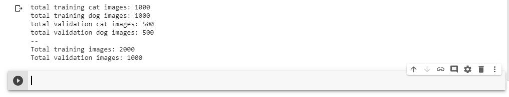

For convenience, set up variables to use while pre-processing the dataset and training the network.

```python
batch_size = 128
epochs = 15
IMG_HEIGHT = 150
IMG_WIDTH = 150
```

### Data preparation
Format the images into appropriately pre-processed floating point tensors before feeding to the network:

1. Read images from the disk.
1. Decode contents of these images and convert it into proper grid format as per their RGB content.
1. Convert them into floating point tensors.
1. Rescale the tensors from values between 0 and 255 to values between 0 and 1, as neural networks prefer to deal with small input values.

Fortunately, all these tasks can be done with the `ImageDataGenerator` class provided by `tf.keras`. It can read images from disk and preprocess them into proper tensors. It will also set up generators that convert these images into batches of tensors—helpful when training the network.

```python
train_image_generator = ImageDataGenerator(rescale=1./255) # Generator for our training data
validation_image_generator = ImageDataGenerator(rescale=1./255) # Generator for our validation data
```

After defining the generators for training and validation images, the `flow_from_directory` method load images from the disk, applies rescaling, and resizes the images into the required dimensions.

```python
train_data_gen = train_image_generator.flow_from_directory(batch_size=batch_size,directory=train_dir,shuffle=True,target_size=(IMG_HEIGHT, IMG_WIDTH),class_mode='binary')
```
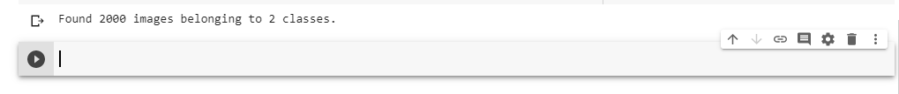

```python
val_data_gen = validation_image_generator.flow_from_directory(batch_size=batch_size,
directory=validation_dir,target_size=(IMG_HEIGHT, IMG_WIDTH),class_mode='binary')
```

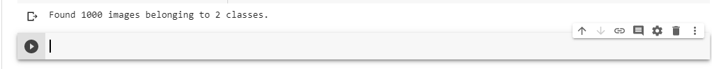

### Visualize training images
Visualize the training images by extracting a batch of images from the training generator—which is 32 images in this example—then plot five of them with `matplotlib`.

```python
sample_training_images, _ = next(train_data_gen)
```

The `next` function returns a batch from the dataset. The return value of next function is in form of `(x_train, y_train)` where `x_train` is training features and `y_train`, its labels. Discard the labels to only visualize the training images.

```python
# This function will plot images in the form of a grid with 1 row and 5 columns where images are placed in each column.
def plotImages(images_arr):
    fig, axes = plt.subplots(1, 5, figsize=(20,20))
    axes = axes.flatten()
    for img, ax in zip( images_arr, axes):
        ax.imshow(img)
        ax.axis('off')
    plt.tight_layout()
    plt.show()
```
```python
plotImages(sample_training_images[:5])
```
Your output should be five different images in a row as shown below

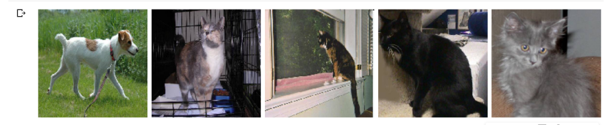

### Create the model
The model consists of three convolution blocks with a max pool layer in each of them. There's a fully connected layer with 512 units on top of it that is activated by a relu activation function.

```python
model = Sequential([
    Conv2D(16, 3, padding='same', activation='relu', input_shape=(IMG_HEIGHT, IMG_WIDTH ,3)),
    MaxPooling2D(),
    Conv2D(32, 3, padding='same', activation='relu'),
    MaxPooling2D(),
    Conv2D(64, 3, padding='same', activation='relu'),
    MaxPooling2D(),
    Flatten(),
    Dense(512, activation='relu'),
    Dense(1)
])
```

### Compile the model

For this tutorial, choose the `ADAM` optimizer and `binary cross entropy` loss function. To view training and validation accuracy for each training epoch, pass the `metrics` argument.

```python
model.compile(optimizer='adam',
              loss=tf.keras.losses.BinaryCrossentropy(from_logits=True),
              metrics=['accuracy'])
```
### Model summary
View all the layers of the network using the model's summary method:

```python
model.summary()
```

The output cell should show

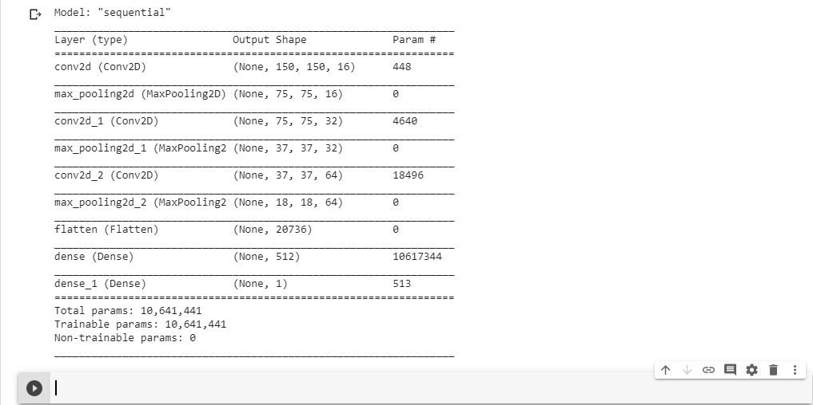


### Train the model
Use the `fit_generator` method of the `ImageDataGenerator` class to train the network.

```python
history = model.fit_generator(
    train_data_gen,
    steps_per_epoch=total_train // batch_size,
    epochs=epochs,
    validation_data=val_data_gen,
    validation_steps=total_val // batch_size
)
```
The output cell should show the outputs below.Allow it to run until it completes all the 15 epochs

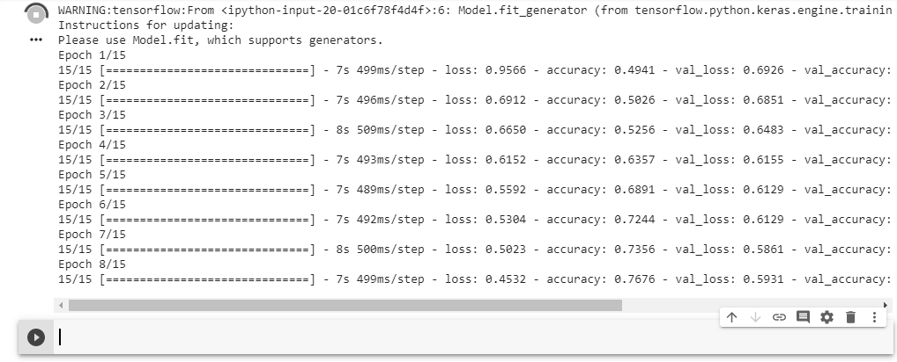

### Visualize training results

Now visualize the results after training the network.

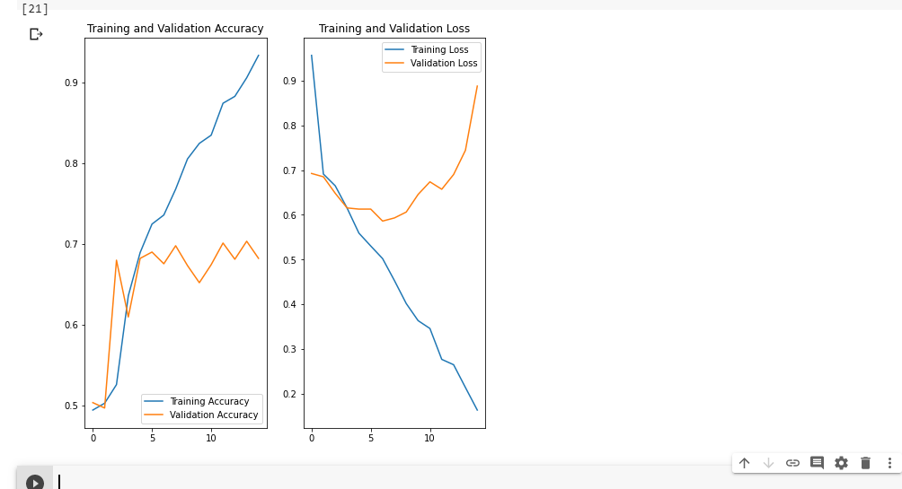

As you can see from the plots, training accuracy and validation accuracy are off by large margin and the model has achieved only around 70% accuracy on the validation set.

Let's look at what went wrong and try to increase overall performance of the model.

### Overfitting

In the plots above, the training accuracy is increasing linearly over time, whereas validation accuracy stalls around 70% in the training process. Also, the difference in accuracy between training and validation accuracy is noticeable—a sign of *overfitting*.

When there are a small number of training examples, the model sometimes learns from noises or unwanted details from training examples—to an extent that it negatively impacts the performance of the model on new examples. This phenomenon is known as overfitting. It means that the model will have a difficult time generalizing on a new dataset.

There are multiple ways to fight overfitting in the training process. In this tutorial, you'll use *data augmentation* and add *dropout* to our model.

### Data augmentation

Overfitting generally occurs when there are a small number of training examples. One way to fix this problem is to augment the dataset so that it has a sufficient number of training examples. Data augmentation takes the approach of generating more training data from existing training samples by augmenting the samples using random transformations that yield believable-looking images. The goal is the model will never see the exact same picture twice during training. This helps expose the model to more aspects of the data and generalize better.

Implement this in `tf.keras` using the `ImageDataGenerator` class. Pass  different transformations to the dataset and it will take care of applying it during the training process.

### Augment and visualize Data

Begin by applying random horizontal flip augmentation to the dataset and see how individual images look like after the transformation.

### Apply Horizontal Flip

Pass `horizontal_flip` as an argument to the `ImageDataGenerator` class and set it to `True` to apply this augmentation.

```python
image_gen = ImageDataGenerator(rescale=1./255, horizontal_flip=True)
```

```python
train_data_gen = image_gen.flow_from_directory(batch_size=batch_size,directory=train_dir,shuffle=True,target_size=(IMG_HEIGHT, IMG_WIDTH))
```

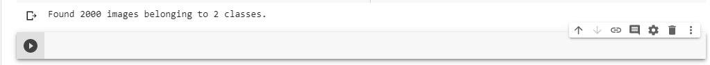

Take one sample image from the training examples and repeat it five times so that the augmentation is applied to the same image five times.

```python
augmented_images = [train_data_gen[0][0][0] for i in range(5)]
```

```python
# Re-use the same custom plotting function defined and used
# above to visualize the training images
plotImages(augmented_images)
```
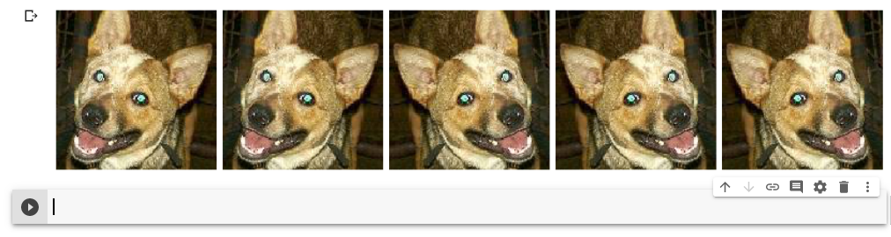

### Randomly rotate the image

Let's take a look at a different augmentation called rotation and apply 45 degrees of rotation randomly to the training examples.

```python
image_gen = ImageDataGenerator(rescale=1./255, rotation_range=45)
```

```python
train_data_gen = image_gen.flow_from_directory(batch_size=batch_size,directory=train_dir,shuffle=True,target_size=(IMG_HEIGHT, IMG_WIDTH))

augmented_images = [train_data_gen[0][0][0] for i in range(5)]
```


```python
plotImages(augmented_images)
```
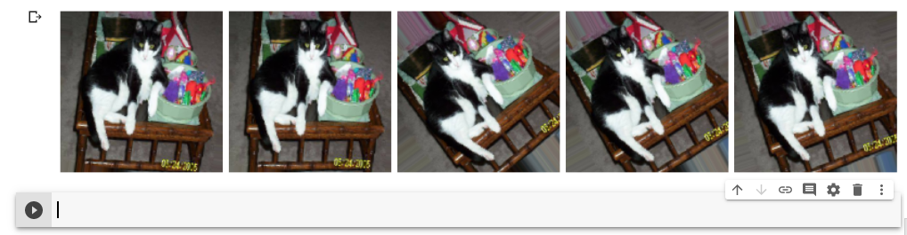


### Apply Zoom Augmentation
Apply a zoom augmentation to the dataset to zoom images up to 50% randomly.

```python
# zoom_range from 0 - 1 where 1 = 100%.
image_gen = ImageDataGenerator(rescale=1./255, zoom_range=0.5) # 
```

```python
train_data_gen = image_gen.flow_from_directory(batch_size=batch_size,directory=train_dir,shuffle=True,target_size=(IMG_HEIGHT, IMG_WIDTH))

augmented_images = [train_data_gen[0][0][0] for i in range(5)]
```


```python
plotImages(augmented_images)
```

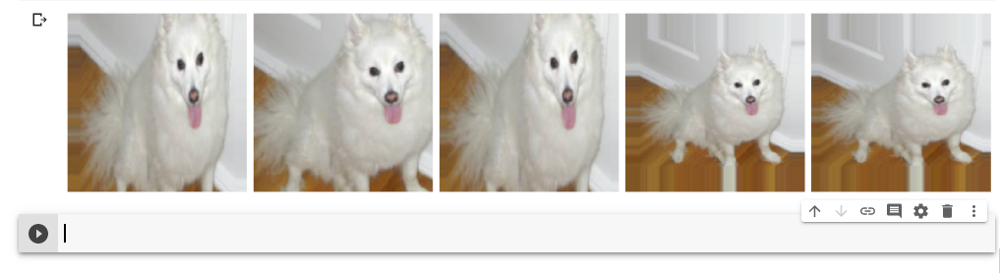

### Putting it all together

Apply all the previous augmentations. Here, you applied rescale, 45 degree rotation, width shift, height shift, horizontal flip and zoom augmentation to the training images.


---
## Author Details
Am a senior student of [Makerere University](https://www.mak.ac.ug/) pursuing a Bachelor of Science degree in Telecommunications Engineering at the [College of Engineering ,Design, Art and Technology](https://cedat.mak.ac.ug/).

## Links to above ipython notebook tutorials

[MyFirstNotebook](https://colab.research.google.com/drive/1zO7_uiTQ40lcxuv4OtaOe3vtKgoXYW0-) : [https://colab.research.google.com/drive/1zO7_uiTQ40lcxuv4OtaOe3vtKgoXYW0-](https://colab.research.google.com/drive/1zO7_uiTQ40lcxuv4OtaOe3vtKgoXYW0-)

[ML Intro](https://colab.research.google.com/drive/12KXXvzdV_2GSmqvwVoZPqSlVHOVe9Hpe?usp=sharing): [https://colab.research.google.com/drive/12KXXvzdV_2GSmqvwVoZPqSlVHOVe9Hpe?usp=sharing](https://colab.research.google.com/drive/12KXXvzdV_2GSmqvwVoZPqSlVHOVe9Hpe?usp=sharing)

[Image Classifier](https://colab.research.google.com/drive/1m0VNPN5rg-l23y3zVk6vlQj9cbgDy1SH?usp=sharing) : [https://colab.research.google.com/drive/1m0VNPN5rg-l23y3zVk6vlQj9cbgDy1SH?usp=sharing](https://colab.research.google.com/drive/1m0VNPN5rg-l23y3zVk6vlQj9cbgDy1SH?usp=sharing)

## Github Repo

You can checkout this page's repository on Github by  clicking the link below.

👉 [https://github.com/KakoozaJerry/getting_started_with_colab](https://github.com/KakoozaJerry/getting_started_with_colab)

---
## Contact Me

If you have any questions about this guide , do not hesitate to contact me on whichever platform you prefer below :) 👇

Email📧 : [abrahamkakooza@gmail.com](mailto:abrahamkakooza@gmail.com)

Twitter🐤 : [@KakoozaJerry](https://twitter.com/KakoozaJerry)

Facebook😉 : [@KakoozaJerry](https://www.facebook.com/kakooza.jerry)


