**[Colab](https://colab.research.google.com)** is a free notebook environment that runs entirely in the cloud. You and team members can edit documents the way you work with [Google docs](https://docs.google.com). It supports many popular Machine Learning(**ML**) libraries such as Keras,Tensorflow,Pytorch etc.

More importantly, one can leverage **free Graphics Processing Units**(GPUs) for machine, scientific computing and 3D visualizations. Scientists, Artists and Engineers need access to massively parallel computational power. Deep learning, physical simulation or molecular modelling are accelerated with several **GPU** types such as NVIDIA Tesla K80, P100, P4, T4 and V100 available depending on compute or visualization needs.

# Table of Contents

- [Basic Python Operations in Notebooks](#my-first-notebook)
    - [Print My First Notebook]()
    - [Variables & Arithmetic]()
    - [Functions]()
- [Machine Learning Intro]()
    - [Model Fitting]()
    - [Prediction]()
    - [Cross-Validation]()
- [How to run a job with GPU]()
---
## My First Notebook


You will need a Gmail account as Colab implicitly uses Google Drive for storing your notebooks, ensure that you are logged in to your Google Drive account before proceeding further.

Step 1 – Open this URL in your browser.[Colab](https://colab.research.google.com) It will display the following Screen.

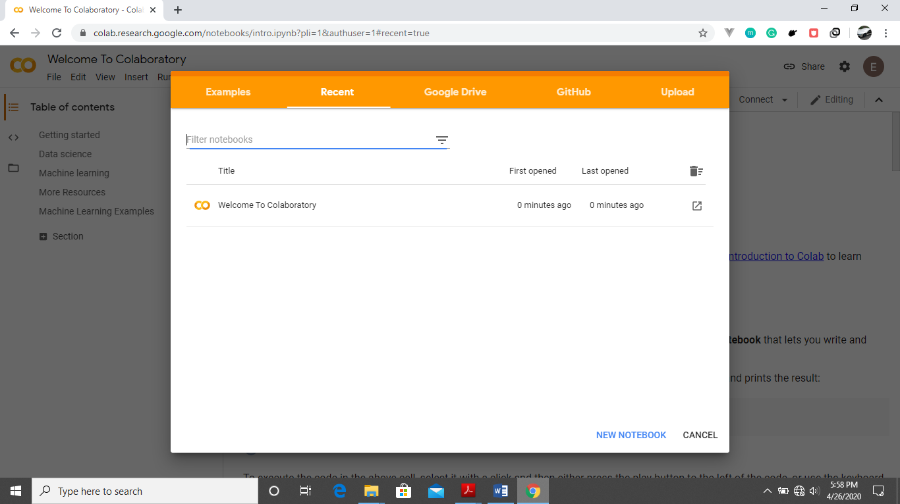

Step 2 – Click on the New Notebook link at the bottom of the screen. A new notebook appears.

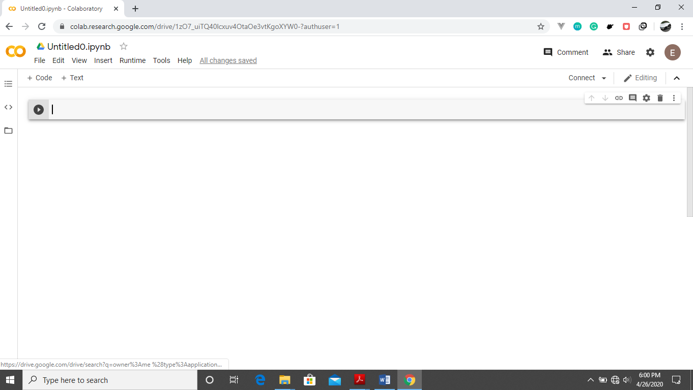


If you are familiar with Jupyter notebooks, the interface looks more or less the same. You have an input cell and an output cell. Above we have the input Cell.

By default, the name of your notebook is labelled Untitled0 for the first notebook , this can be changed for easier tracking of your projects.

Step – 3 To rename your notebook, click on the file tab , then click rename . 

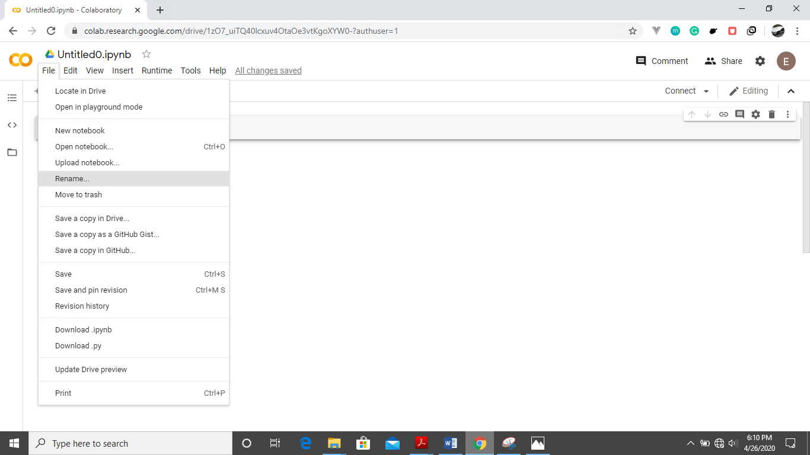

Change your name to MyFirstNotebook as shown below.

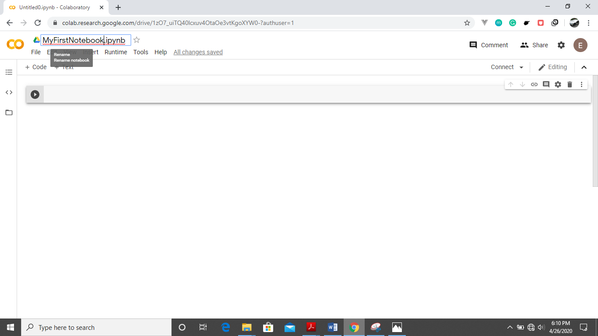

Step – 4 Connect to a runtime server by clicking the connect button as shown below

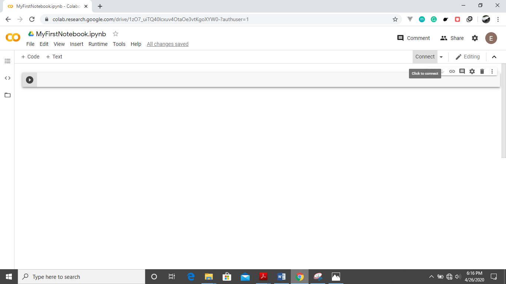

It will connect to a specified runtime and show the screen below.

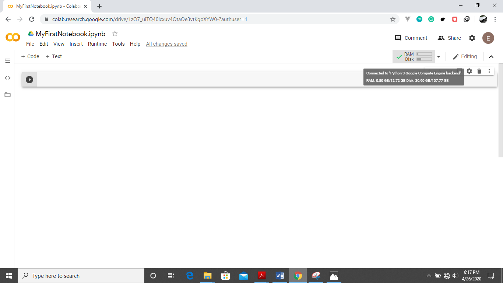

Step 5- You can now type your code in the cell shown .Type

`print(“Welcome to your first notebook”)`

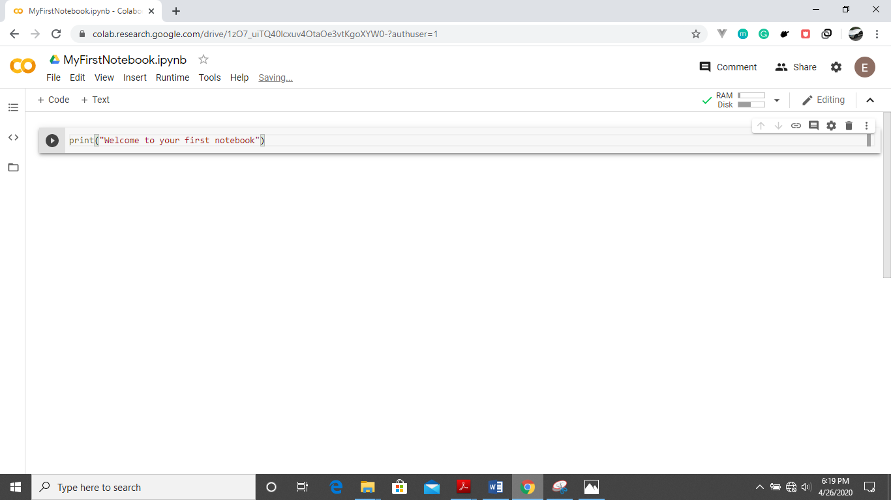

Step 6- To run the cell, you can either use Shift+Enter keys or click Runtime>Run the Focused Cell

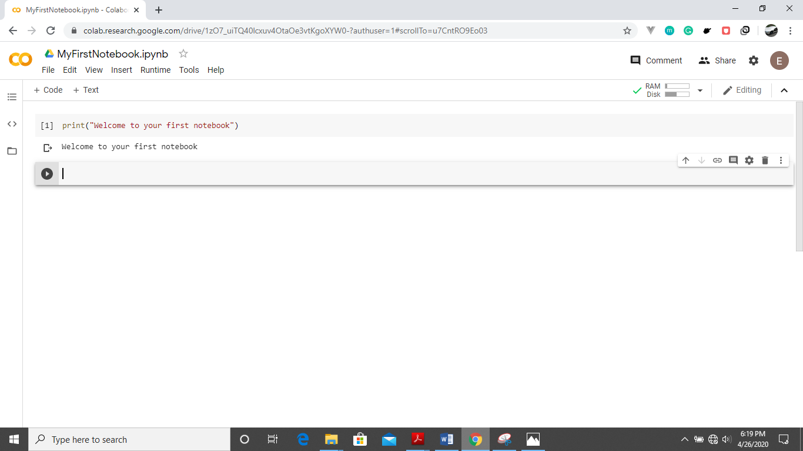

Step 7- Click on +Code tab above to create a code cell. 

Congratulations, You just created your first google Colab notebook. Navigate  to the extreme left pane and click on the three lines . Below is the screen that will show.Here you can navigate your notebook easily to various parts of it such as sections.

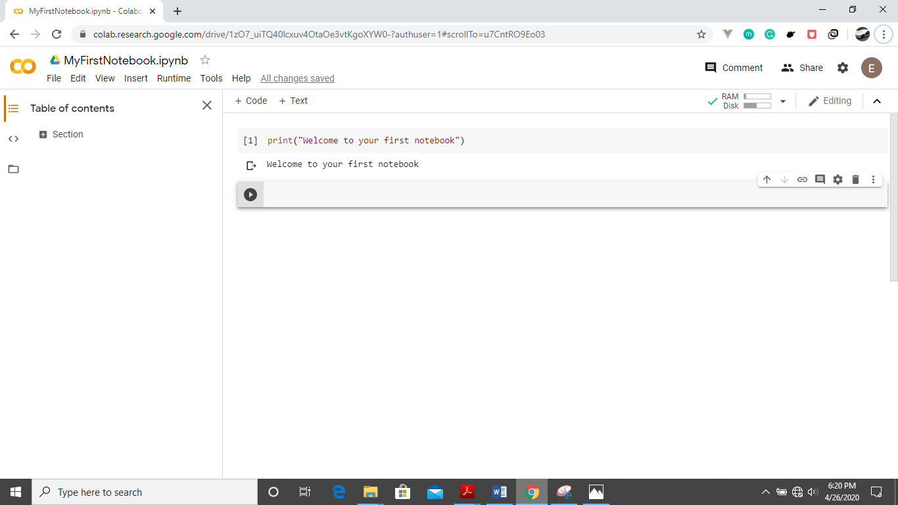

Also click on <> button  to view code snippets that can easily be searched and used directly in your colab notebook.

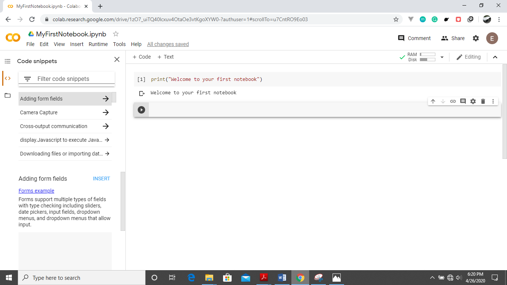

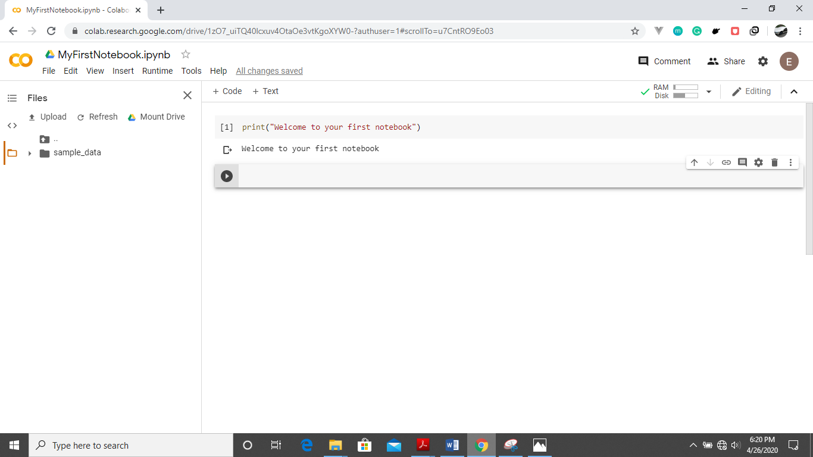

**Uploading data to your Colab environment from your local machine.**
Click on the Folder icon at the left pane , then the Upload button. Below is the window that pops up.

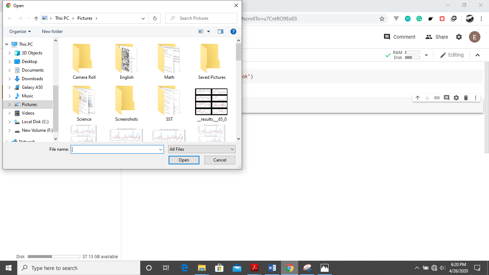

Select the files you wish to upload and click Open.

**Downloading Datasets into Google Drive via Google Colab**

First, we will have to mount our google drive to our notebook environment. This is by clicking the folder icon at the extreme left pane and then the mount Drive button at the top .You will have to authorize the right gmail account ,so the screen below is shown.

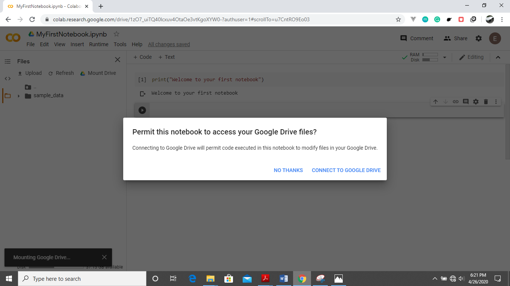

Click on connect to google Drive button and the drive folder is created in your working directory structure so you can either move data to your Google drive or export it from there into your runtime environment.

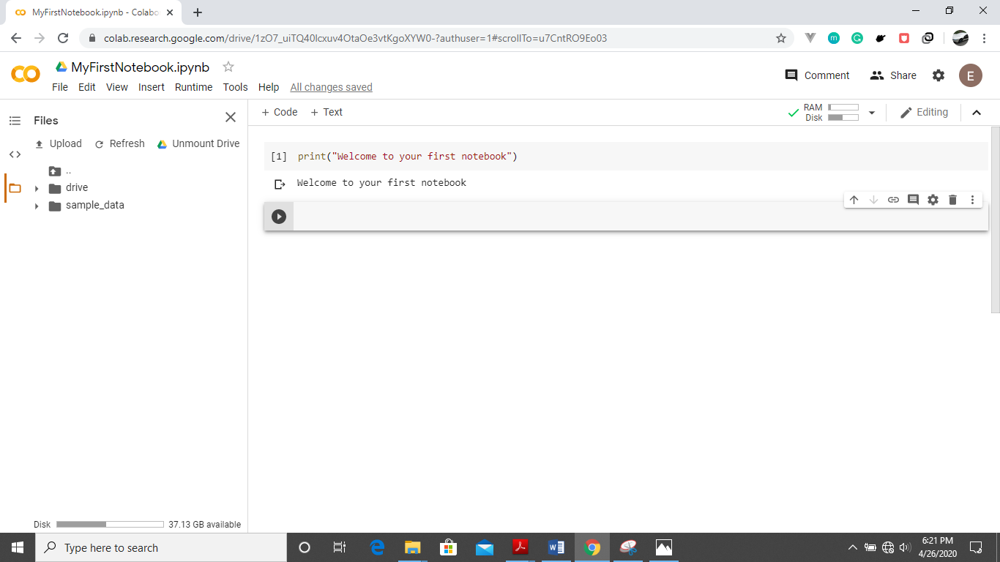

**Saving your notebook to Google drive**

In order to do this, you will have to click on File>Save a Copy in Drive and follow the prompts.

**Saving your notebook to Github**

First, you will have to click on File>Save a Copy in Github.Incase it is the first time , you are prompted with an authorization window  shown below.

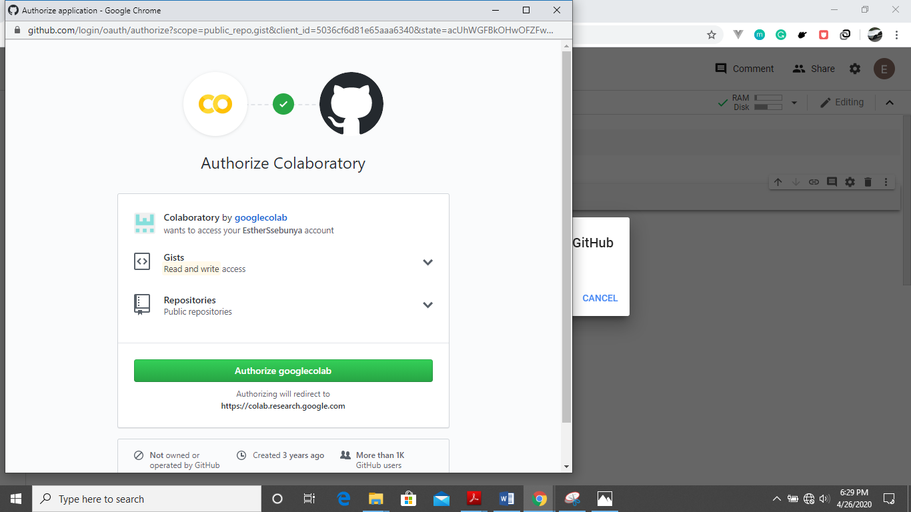

Edit the public repository you wish to save your notebook in or automatically Colab creates a public repo named your file title. You can also change the commit message as shown below.

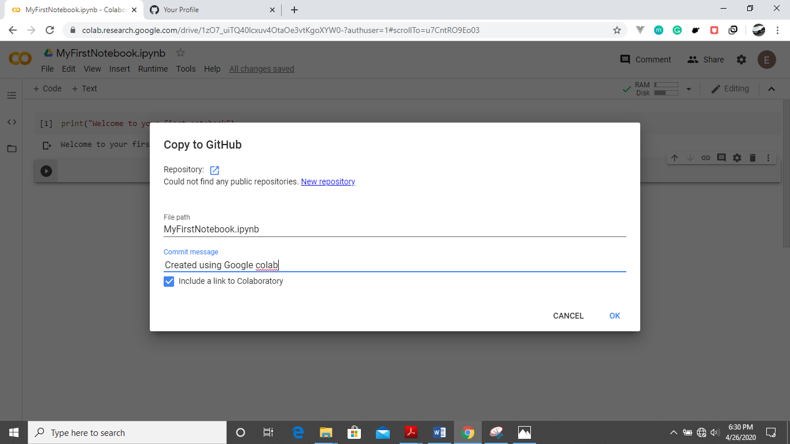

**Getting started with running a GPU job on Google Colab.**

**Enabling GPU**

To successfully run a GPU job, you need to change your runtime type by clicking Runtime>Change runtime type. The window below shows.

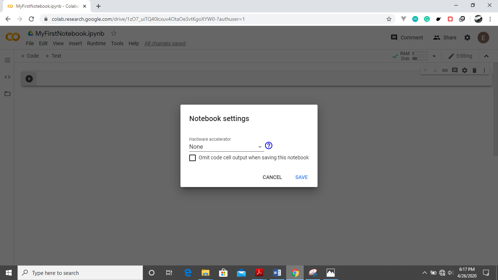

Select the drop down at the Hardware accelerator then choose GPU.

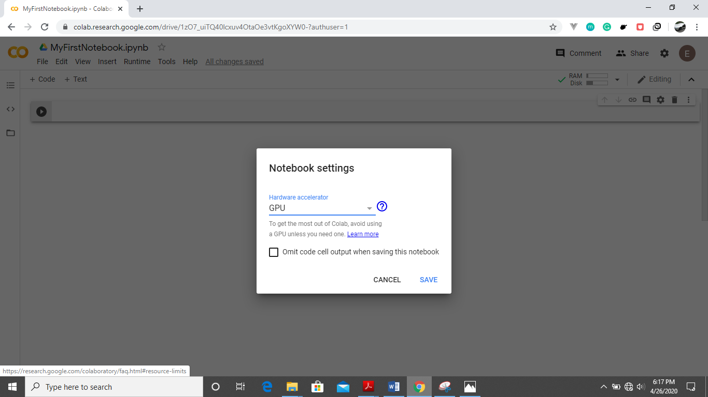

Click the save button and you should be able to read the words Connected to a Python 3 GPU after hoovering over the RAM Disk button above as shown below


By default, Colab gives you about 12GB of ram and 68 GB of storage. The RAM can be upgraded to 25GB or more if you run a program that utilizes all of it up.

You can run your code in the cells as shown above to kick start your project.

**NB:** Incase you are doing a  computational intensive program, it is advisable to always first change your runtime to GPU before you start typing your code. Also you can always double ckeck to see if you are connected to a GPU by running the command.

```python
import tensorflow as tf
tf.test.gpu_device_name()
```

If the GPU is enabled, it will give the following output below


```python
/device:GPU:0
```
---
## Author Details
Am a senior student of [Makerere University](https://www.mak.ac.ug/) pursuing a Bachelor of Science degree in Telecommunications Engineering at the [College of Engineering ,Design, Art and Technology](https://cedat.mak.ac.ug/).

## Links to above ipython notebook tutorials


## Github Repo

You can checkout this page's repository on Github by  clicking the link below.

👉 [https://github.com/KakoozaJerry/getting_started_with_colab](https://github.com/KakoozaJerry/getting_started_with_colab)

---
## Contact Me

If you have any questions about this guide , do not hesitate to contact me on whichever platform you prefer below :) 👇

Email📧 : [abrahamkakooza@gmail.com](mailto:abrahamkakooza@gmail.com)

Twitter🐤 : [@KakoozaJerry](https://twitter.com/KakoozaJerry)

Facebook😉 : [@KakoozaJerry](https://www.facebook.com/kakooza.jerry)


