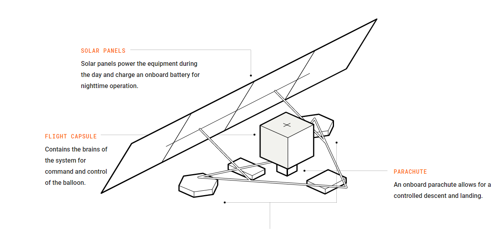

GOOGLE COLAB MACHINE AND SCIENTIFIC COMPUTING BASICS
=====================================================

**Colab** is a free notebook environment that runs entirely in the cloud. You and team members can edit documents, the way you work with Google docs. It supports many popular Machine Learning(**ML**) libraries such as Keras,Tensorflow,Pytorch etc.

More importantly, one can leverage **free Graphics Processing Units**(GPUs) for machine, scientific computing and 3D visualizations. Scientists, Artists and Engineers need access to massively parallel computational power. Deep learning, physical simulation or molecular modelling are accelerated with several **GPU** types such as NVIDIA Tesla K80, P100, P4, T4 and V100 available depending on compute or visualization needs.

My First Notebook
------------------

You will need a Gmail account as Colab implicitly uses Google Drive for storing your notebooks, ensure that you are logged in to your Google Drive account before proceeding further.
Step 1 – Open this URL in your browser.[colab url] It will display the following Screen.

Step 2 – Click on the New Python 3 notebook link at the bottom of the screen. A new notebook appears.

`************image************`

If you are familiar with Jupyter notebooks, the interface looks more or less the same. 
